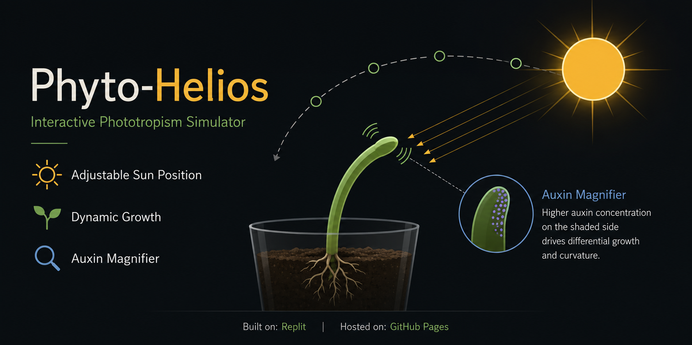

  

# ☀️ Phototrophism Simulator

Interactive HTML simulator visualizing plant phototropism through directional light sensing, auxin redistribution, and differential growth.

---

## ✨ Features

* **Dynamic Growth:** Observe shoot bending in response to changing sunlight direction.
* **Adjustable Sun Position:** Reposition the light source to investigate phototropic responses.
* **Auxin Magnifier:** Visualize auxin redistribution and the Cholodny–Went bending mechanism.
* **Responsive Design:** Optimized for desktop and mobile devices.

---

## 🚀 Built With & Hosted On

* **Repository:** GitHub
* **Hosting:** GitHub Pages

---

## 🛠️ Credits & Acknowledgments

* **Claude Sonnet:** Debugging, code generation & architecture.
* **Replit:** Code improvisation & rapid prototyping.
* **OpenAI:** Scientific debugging, testing & logic optimization.

---

## 👤 Author

* **Draven Ashcroft**
  * M.Sc. Ag. Entomology, ASRB NET
  * DIPS Chain of Institutions

---

## 📜 License

GPL-3.0
